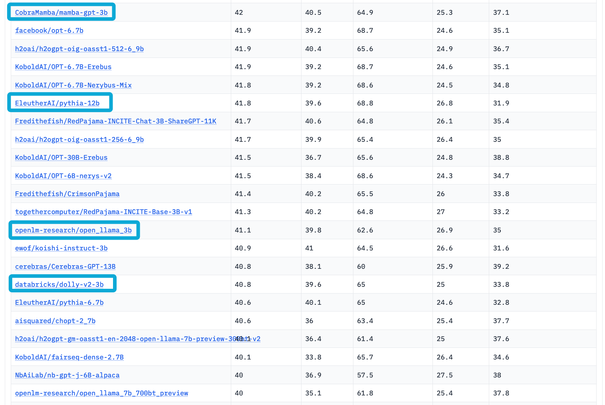

# mamba-gpt-3b: The Best 3B model Fully Open-Source Instruction-Following Model Based On OpenLLaMA

It is almost the best 3B model in the current open source industry, surpassing dolly-v2-3b, open-lama-3b, and even outperforming the EleutherAI/pythia-12b model in terms of performance. Can refer to open_llm_leaderboard

| Metric                | Value |
|-----------------------|-------|
| MMLU (5-shot)         | 25.3  |
| ARC (25-shot)         | 40.5  |
| HellaSwag (10-shot)   | 64.9  |
| TruthfulQA (0-shot)   | 37.1  |
| Avg.                  | 42.0  | 

We use state-of-the-art [Language Model Evaluation Harness](https://github.com/EleutherAI/lm-evaluation-harness) to run the benchmark tests above.


<p align="center" width="100%">

</p>


This is the repo for the mamba-gpt-3b project, which aims to build and share an instruction-following model based on [OpenLLaMA](https://github.com/openlm-research/open_llama). We note that, following OpenLLaMA, mamba-gpt-3b is permissively licensed under [the Apache 2.0 license](https://www.apache.org/licenses/LICENSE-2.0). We also highlight that the training of mamba-gpt-3b only using one A100 GPUs.

This repo contains
- The <a href='#weights'>weights</a> for the fine-tuned model.
- The <a href='#data'>data</a> used for fine-tuning the model.
- The <a href='#example_usage'>example usage</a> of mamba-gpt-3b.
- The <a href='#code'>code</a> for fine-tuning the model.

**Usage and License Notices:** mamba-gpt-3b follows the distribution permission of [OpenLLaMA](https://github.com/openlm-research/open_llama), i.e. the Apache 2.0 license, which means OpenAlpaca can be used in any academic or commercial purposes for free.

****

# News:
* [2023/07/24] Open-sourced mamba-gpt-3b.

****

<span id='weights'/>

# Model Card
## Summary

We have fine-tuned the open-lama model and surpassed the original model in multiple evaluation subtasks, making it currently the best performing 3B model with comparable performance to llama-7b
- Base model: [openlm-research/open_llama_3b](https://huggingface.co/openlm-research/open_llama_3b)

## Usage

To use the model with the `transformers` library on a machine with GPUs, first make sure you have the `transformers`, `accelerate` and `torch` libraries installed.

```bash
pip install transformers==4.29.2
pip install accelerate==0.19.0
pip install torch==2.0.0
```

```python
import torch
from transformers import pipeline

generate_text = pipeline(
    model="CobraMamba/mamba-gpt-3b",
    torch_dtype="auto",
    trust_remote_code=True,
    use_fast=False,
    device_map={"": "cuda:0"},
)

res = generate_text(
    "Why is drinking water so healthy?",
    min_new_tokens=2,
    max_new_tokens=1024,
    do_sample=False,
    num_beams=1,
    temperature=float(0.3),
    repetition_penalty=float(1.2),
    renormalize_logits=True
)
print(res[0]["generated_text"])
```

You can print a sample prompt after the preprocessing step to see how it is feed to the tokenizer:

```python
print(generate_text.preprocess("Why is drinking water so healthy?")["prompt_text"])
```

```bash
<|prompt|>Why is drinking water so healthy?</s><|answer|>
```

Alternatively, you can download the mamba_gpt_pipeline.py, store it alongside your notebook, and construct the pipeline yourself from the loaded model and tokenizer. If the model and the tokenizer are fully supported in the `transformers` package, this will allow you to set `trust_remote_code=False`.

```python
import torch
from mamba_gpt_pipeline.py import MambaGPTTextGenerationPipeline
from transformers import AutoModelForCausalLM, AutoTokenizer

tokenizer = AutoTokenizer.from_pretrained(
    "CobraMamba/mamba-gpt-3b",
    use_fast=False,
    padding_side="left",
    trust_remote_code=False,
)
model = AutoModelForCausalLM.from_pretrained(
    "CobraMamba/mamba-gpt-3b",
    torch_dtype="auto",
    device_map={"": "cuda:0"},
    trust_remote_code=False,
)
generate_text = MambaGPTTextGenerationPipeline(model=model, tokenizer=tokenizer)

res = generate_text(
    "Why is drinking water so healthy?",
    min_new_tokens=2,
    max_new_tokens=1024,
    do_sample=False,
    num_beams=1,
    temperature=float(0.3),
    repetition_penalty=float(1.2),
    renormalize_logits=True
)
print(res[0]["generated_text"])
```


You may also construct the pipeline from the loaded model and tokenizer yourself and consider the preprocessing steps:

```python
from transformers import AutoModelForCausalLM, AutoTokenizer

model_name = "CobraMamba/mamba-gpt-3b"  # either local folder or huggingface model name
# Important: The prompt needs to be in the same format the model was trained with.
# You can find an example prompt in the experiment logs.
prompt = "<|prompt|>How are you?</s><|answer|>"

tokenizer = AutoTokenizer.from_pretrained(
    model_name,
    use_fast=False,
    trust_remote_code=False,
)
model = AutoModelForCausalLM.from_pretrained(
    model_name,
    torch_dtype="auto",
    device_map={"": "cuda:0"},
    trust_remote_code=False,
)
model.cuda().eval()
inputs = tokenizer(prompt, return_tensors="pt", add_special_tokens=False).to("cuda")

# generate configuration can be modified to your needs
tokens = model.generate(
    **inputs,
    min_new_tokens=2,
    max_new_tokens=1024,
    do_sample=False,
    num_beams=1,
    temperature=float(0.3),
    repetition_penalty=float(1.2),
    renormalize_logits=True
)[0]

tokens = tokens[inputs["input_ids"].shape[1]:]
answer = tokenizer.decode(tokens, skip_special_tokens=True)
print(answer)
```

## Model Architecture

```
LlamaForCausalLM(
  (model): LlamaModel(
    (embed_tokens): Embedding(32000, 4096, padding_idx=0)
    (layers): ModuleList(
      (0-31): 32 x LlamaDecoderLayer(
        (self_attn): LlamaAttention(
          (q_proj): Linear(in_features=4096, out_features=4096, bias=False)
          (k_proj): Linear(in_features=4096, out_features=4096, bias=False)
          (v_proj): Linear(in_features=4096, out_features=4096, bias=False)
          (o_proj): Linear(in_features=4096, out_features=4096, bias=False)
          (rotary_emb): LlamaRotaryEmbedding()
        )
        (mlp): LlamaMLP(
          (gate_proj): Linear(in_features=4096, out_features=11008, bias=False)
          (down_proj): Linear(in_features=11008, out_features=4096, bias=False)
          (up_proj): Linear(in_features=4096, out_features=11008, bias=False)
          (act_fn): SiLUActivation()
        )
        (input_layernorm): LlamaRMSNorm()
        (post_attention_layernorm): LlamaRMSNorm()
      )
    )
    (norm): LlamaRMSNorm()
  )
  (lm_head): Linear(in_features=4096, out_features=32000, bias=False)
)
```

## Evaluation
We evaluated OpenLLaMA on a wide range of tasks using [lm-evaluation-harness](https://github.com/EleutherAI/lm-evaluation-harness).  The LLaMA results are generated by running the original LLaMA model on the same evaluation metrics. We note that our results for the LLaMA model differ slightly from the original LLaMA paper, which we believe is a result of different evaluation protocols. Similar differences have been reported in [this issue of lm-evaluation-harness](https://github.com/EleutherAI/lm-evaluation-harness/issues/443). Additionally, we present the results of GPT-J, a 6B parameter model trained on the [Pile](https://pile.eleuther.ai/) dataset by [EleutherAI](https://www.eleuther.ai/).

The original LLaMA model was trained for 1 trillion tokens and GPT-J was trained for 500 billion tokens.  We present the results in the table below. OpenLLaMA exhibits comparable performance to the original LLaMA and GPT-J across a majority of tasks, and outperforms them in some tasks.


| **Task/Metric**        | finetuned-GPT 3B  | OpenLLaMA 3B |
| ---------------------- | -------- | ------------ |
| anli_r1/acc            | **0.35** | 0.33         |      
| anli_r2/acc            | **0.33** | 0.32         | 
| anli_r3/acc            | 0.35     | 0.35         | 
| arc_challenge/acc      | **0.35** | 0.34         | 
| arc_challenge/acc_norm | 0.37     | 0.37         |
| arc_easy/acc           | **0.71** | 0.69         | 
| arc_easy/acc_norm      | 0.65     | 0.65         | 
| boolq/acc              | **0.72** | 0.66         | 
| hellaswag/acc          | **0.49** | 0.43         | 
| hellaswag/acc_norm     | 0.66     | **0.67**         |
| openbookqa/acc         | 0.26     | **0.27**         | 
| openbookqa/acc_norm    | 0.40     | 0.40         | 
| piqa/acc               | **0.76** | 0.75         | 
| piqa/acc_norm          | 0.76     | 0.76         | 
| record/em              | 0.88     | 0.88         | 
| record/f1              | 0.88     | **0.89**         | 
| rte/acc                | 0.55     | **0.58**         | 
| truthfulqa_mc/mc1      | **0.27** | 0.22         | 
| truthfulqa_mc/mc2      | **0.37** | 0.35         |
| wic/acc                | **0.49** | 0.48         | 
| winogrande/acc         | **0.63** | 0.62         | 
| Average                | **0.53** | 0.52         | 


We removed the task CB and WSC from our benchmark, as our model performs suspiciously well on these two tasks. We hypothesize that there could be a benchmark data contamination in the training set.

## Disclaimer

Please read this disclaimer carefully before using the large language model provided in this repository. Your use of the model signifies your agreement to the following terms and conditions.

- Biases and Offensiveness: The large language model is trained on a diverse range of internet text data, which may contain biased, racist, offensive, or otherwise inappropriate content. By using this model, you acknowledge and accept that the generated content may sometimes exhibit biases or produce content that is offensive or inappropriate. The developers of this repository do not endorse, support, or promote any such content or viewpoints.
- Limitations: The large language model is an AI-based tool and not a human. It may produce incorrect, nonsensical, or irrelevant responses. It is the user's responsibility to critically evaluate the generated content and use it at their discretion.
- Use at Your Own Risk: Users of this large language model must assume full responsibility for any consequences that may arise from their use of the tool. The developers and contributors of this repository shall not be held liable for any damages, losses, or harm resulting from the use or misuse of the provided model.
- Ethical Considerations: Users are encouraged to use the large language model responsibly and ethically. By using this model, you agree not to use it for purposes that promote hate speech, discrimination, harassment, or any form of illegal or harmful activities.
- Reporting Issues: If you encounter any biased, offensive, or otherwise inappropriate content generated by the large language model, please report it to the repository maintainers through the provided channels. Your feedback will help improve the model and mitigate potential issues.
- Changes to this Disclaimer: The developers of this repository reserve the right to modify or update this disclaimer at any time without prior notice. It is the user's responsibility to periodically review the disclaimer to stay informed about any changes.

By using the large language model provided in this repository, you agree to accept and comply with the terms and conditions outlined in this disclaimer. If you do not agree with any part of this disclaimer, you should refrain from using the model and any content generated by it.


# Future Plans:

1. The current model is fine-tuned on the previewed version of OpenLLaMA. We expect the performance of the base OpenLLaMA model to improve as the training continues. We will update the version of mamba-gpt-3b so long as newer checkpoint is released by the authors of OpenLLaMA.

2. We also plan to do a rigorous evaluation of OpenAlpaca and compare it with other publicly accessible models.

<span id='reference'/>

# Reference:

If you found OpenAlpaca useful in your research or applications, please kindly cite using the following BibTeX:
```
@misc{openalpaca,
  author = {Yixuan Su and Tian Lan and Deng Cai},
  title = {OpenAlpaca: A Fully Open-Source Instruction-Following Model Based On OpenLLaMA},
  year = {2023},
  publisher = {GitHub},
  journal = {GitHub repository},
  howpublished = {\url{https://github.com/yxuansu/OpenAlpaca}},
}
```
```
@software{openlm2023openllama,
  author = {Xinyang Geng and Hao Liu},
  title = {OpenLLaMA: An Open Reproduction of LLaMA},
  month = May,
  year = 2023,
  url = {https://github.com/openlm-research/open_llama}
}
```
```
@misc{alpaca,
  author = {Rohan Taori and Ishaan Gulrajani and Tianyi Zhang and Yann Dubois and Xuechen Li and Carlos Guestrin and Percy Liang and Tatsunori B. Hashimoto },
  title = {Stanford Alpaca: An Instruction-following LLaMA model},
  year = {2023},
  publisher = {GitHub},
  journal = {GitHub repository},
  howpublished = {\url{https://github.com/tatsu-lab/stanford_alpaca}},
}
```
```
@article{touvron2023llama,
  title={Llama: Open and efficient foundation language models},
  author={Hugo Touvron and Thibaut Lavril and Gautier Izacard and Xavier Martinet and Marie{-}Anne Lachaux and Timoth{\'{e}}e Lacroix and Baptiste Rozi{\`{e}}re and Naman Goyal and Eric Hambro and Faisal Azhar and Aur{\'{e}}lien Rodriguez and Armand Joulin and Edouard Grave and Guillaume Lample},
  journal={arXiv preprint arXiv:2302.13971},
  year={2023}
}
```

<span id='acknowledgements'/>

# Acknowledgements:

This repo benefits from [OpenLLaMA](https://github.com/openlm-research/open_llama), [Alpaca](https://github.com/tatsu-lab/stanford_alpaca), and [Databricks](https://www.databricks.com/). Thanks for their wonderful works!

